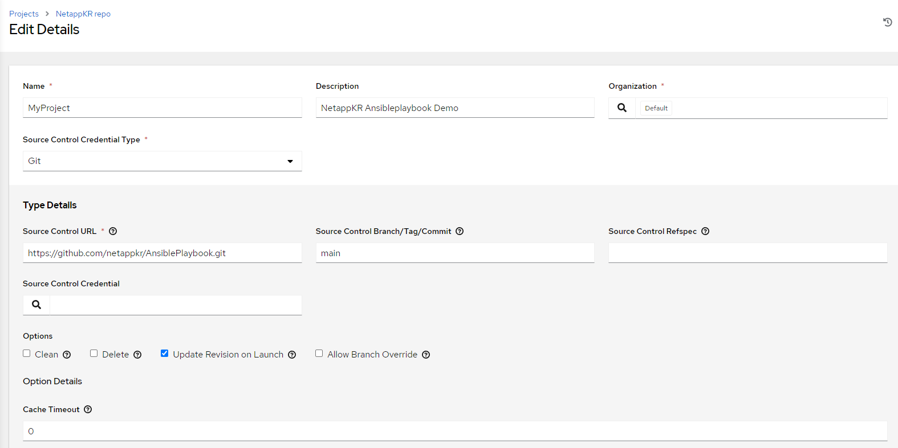
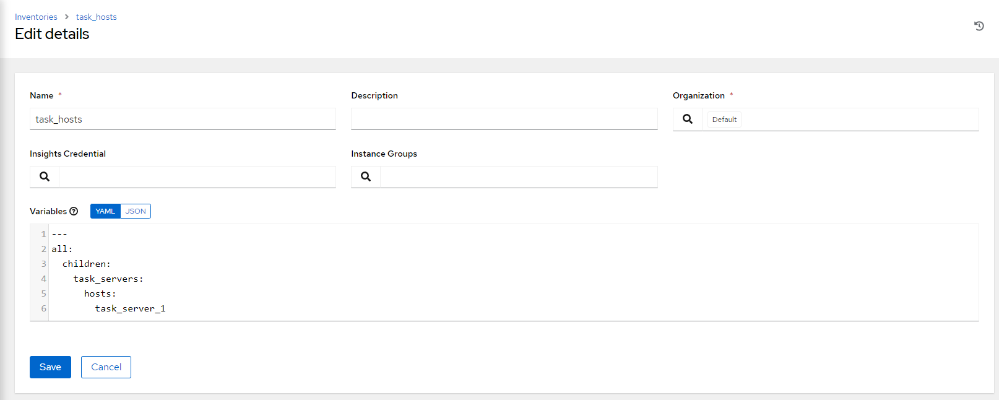
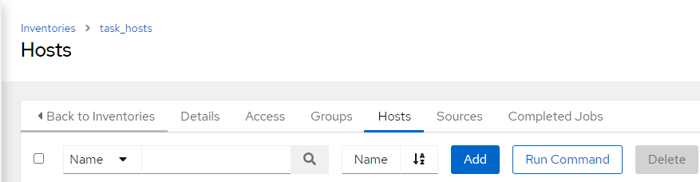
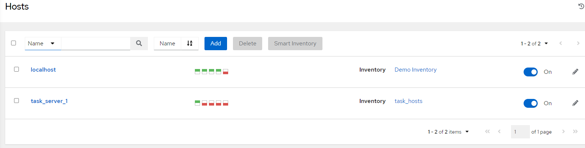
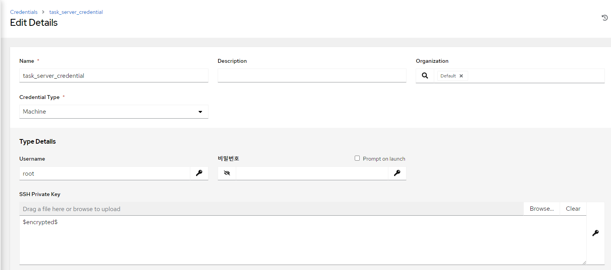
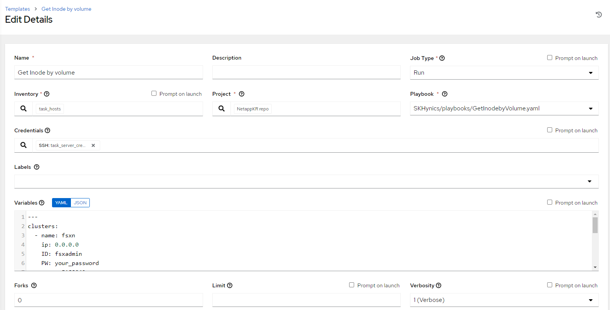

# AWX 빠른 구성 가이드
빠른 시작 가이드를 작성합니다.</br>
AWX 타워의 문서가 잘되어 있기 때문에 자세한 내용은 AWX 타워의 내용을 참고하시는 것이 좋습니다.

**가이드에 설명되어 있지 않은 옵션들은 모두 기본값으로 입력합니다.**

## Project 구성
Template, 인벤토리, 호스트등의 정보를 관리할 프로젝트를 생성합니다.</br>
프로젝트 생성 시 저장소 설정을 할 수 있습니다.

#### Create New Project


1. 아래 항목을 입력합니다.
- Name : MyProject
- Description: NetappKR Ansibleplaybook Demo
- Org : default
- Source Control Credential Type: **Git**
    - Git : 깃헙 저장소에서 소스파일을 불러옵니다. 
    - Manual : 로컬 디스크에서 소스파일을 읽어드립니다.
#### Type Details
- Source Control URL: ```https://github.com/netappkr/AnsiblePlaybook.git```
- Source Control Branch/Tag/Commit : main

#### Option
- ```Update Revision on Launch``` : [v] : 이 프로젝트를 사용하여 작업이 실행될 때마다 작업을 시작하기 전에 프로젝트 개정판을 업데이트하십시오.

> ### Tips
> 다른 예제를 보고싶나요?
>
> netapp의 엔지니어분들이 깃헙에 올려둔 [sample_example_playbook](https://github.com/NetApp/ansible_example_playbooks)을 활용해보세요. 
>

## inventory 구성
Ansible은 인프라에 존재하는 여러 호스트를 관리합니다.

이런 호스트의 목록 또는 그룹을 지정하는 파일이 인벤토리 입니다.

인벤토리가 정의되면 패턴을 사용하여 Ansible 을 실행할 노드 또는 그룹을 선택할 수 있습니다.


1. 사이드메뉴에서 ```Inventories```를 클릭합니다.
2. 아래와 같이 입력합니다.

- Name : task_hosts
- Org: Default
- Variables
    ```yaml
    ---
    all:
    children:
        task_servers:
        hosts:
            task_server_1
    ---
    ```
3. ```Save```
4. ```Host``` Tab > ```Add``` 

5. 아래와 같이 입력합니다.
- Name : task_sever_1
- Variables
    ```yaml
    ---
    ansible_host: <<AWX 서버 IP>>
    ```
    

## Credentials 구성
인증관리 입니다.

1. 사이드메뉴에서 ```Credentials``` 클릭
2. ```add```
3. 아래와 같이 입력합니다.

- Name : task_server_credential

    **인증 부분은 사용하시는 환경에 맞게 적절하게 입력하세요**

## Templates 작성
수행 코드가 들어가는 탬플릿입니다. 

1. 사이드메뉴에서 ```Templates```를 찾습니다.
2. ```add```
3. 아래 항목을 입력합니다.

- Name: Get Inode by Volume
- Inventory : task_hosts
- Project : MyProject ( 예시 사진값과 다릅니다)
- Playbook : ```GetInodebyVolume.yaml``` ( 예시 사진과 경로가 다를 수 있습니다.)
- Credentials : ```Task_server_Credentials```
- Variables : **SMTP 접속정보 및 cluster 접속정보를 양식에 맞게 입력하세요.**
    ```yaml
    ---
    clusters:
    - name: your cluster name 1
        ip: 0.0.0.0
        ID: fsxadmin
        PW: your_password
    - name: your cluster name 2
        ip: 0.0.0.0
        ID: admin
        PW: your_password
    scripts_dir: '/opt/awx/projects'
    email_to: "wooyoung.ahn@netapp.com"
    email_from: "email_from"
    smtp_server: "smtp.gmail.com"
    smtp_port: 587
    smtp_username: "smtp_username"
    smtp_password: "smtp_password"
    ```
> ### Tips
> 별도의 메일서버가 없으신가요? 
> 
> Gmail을 사용하여 SMTP 설정을 해보세요. 자세한 내용은 Gmail 측 가이드를 따르세요.

## 플레이북 수행

## 결과
아래와 같은 메일을 받아볼 수 있습니다. </br>


