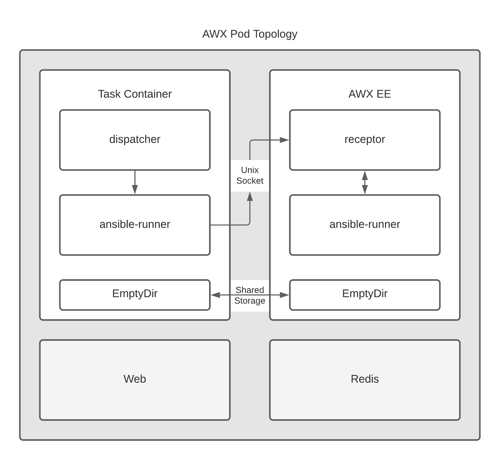

# AWX 17.1.0 install Guide
AWX 17.1.0 버전을 설치합니다.
- 최신버전 설치는 K8S 환경에서 오퍼레이터를 이용하여 설치해야 합니다.
- RPM 설치는 [AWX-RPM](https://awx.wiki/installation)에서 찾아볼 수 있습니다만 AWX 정식 배포에 포함된 내용이 아닙니다.
## Architecture


> ### AWX 24.0.0 설치
> 작성 당시 최신 버전인 ```24.0.0``` 버전도 설치에 성공했으나 가이드는 ```17.1.0``` 으로 남깁니다.


## Pre-requirment
설치 환경 및 필수 항목들을 정의합니다.
- OS : 페도라 계열 8.x
- CPU : 2 core
- Mem : 4 Mem ( 권장 8 )
- Storage: 20GB of space ()
- Running Docker, Openshift, or Kubernetes
If you choose to use an external PostgreSQL database, please note that the minimum version is 10+.

### Pre-Install
EPEL 리포지토리와 Docker가 모두 Red Hat 서버에 이미 설치되어 있는지 확인하세요. 설정 가이드를 참조하세요.
1. 필요한 패키지 설치
```bash
dnf install git gcc gcc-c++ nodejs gettext device-mapper-persistent-data lvm2 bzip2 python3-pip ansible
```
2. Install Docker Engine, containerd, and Docker Compose:
```bash
sudo yum install -y yum-utils
sudo yum-config-manager --add-repo https://download.docker.com/linux/centos/docker-ce.repo
sudo yum install docker-ce docker-ce-cli containerd.io docker-buildx-plugin docker-compose-plugin
```
3. Start Docker.
```bash
sudo systemctl start docker
pip3 install pyyaml==5.3.1
pip3 install docker-compose
dnf -y installl docker-compose-plugin
```
4. docker-compose 명령 구성
```bash
ln -f -s /usr/libexec/docker/cli-plugins/docker-compose /usr/local/bin/docker-compose
```

## Ansible AWX 17.1.0 설치
다음 명령을 사용하여 v17 릴리스를 복제합니다.
```
git clone -b "17.1.0" https://github.com/ansible/awx.git
```
다음 명령을 사용하여 비밀 암호화 키를 생성합니다.
```
openssl rand -base64 30
iR0MXri042xWjgqztRXFK1eLERtU+9g2OhYRVWld
```
디렉터리 로 이동하여 인벤토리awx/installer 파일을 찾습니다.
```
cd awx/installer/
vim inventory
```
아래 항목을 찾아 수정합니다.
```ini
[all:vars]
local_docker=true
# your credentials >> Use the key you created with `openssl rand -base64 30`
secret_key=iR0MXri042xWjgqztRXFK1eLERtU+9g2OhYRVWld

admin_user=admin
admin_password=password
```
인벤토리 파일 에서 PostgresSQL 데이터를 보관할 폴더를 ```​/opt/awx```로 변경합니다​.
```ini
postgres_data_dir="/opt/awx/pgdocker"
host_port=80
host_port_ssl=443
#ssl_certificate=
# Optional key file
#ssl_certificate_key=
docker_compose_dir="/opt/awx/awxcompose"
```
여기서 무엇을 선택하든 디렉터리가 존재하고 Docker 사용자가 쓸 수 있는지 확인하세요.
```
sudo mkdir /opt/awx
```
git clone 한 경로에서 설치 파일을 몇개 수정해야 합니다.
```
vim installer/roles/local_docker/tasks/main.yml
```
맨윗줄에 추가
```yaml
- name: Install Docker SDK for Python
  ansible.builtin.pip:
    name:
      - "docker==6.1.3"
      - "docker-compose"
```

이제 ```​awx/installer/``` 내부에서 Ansible 명령을 따라 Ansible AWX를 설치할 수 있습니다.
```bash
sudo ansible-playbook -i inventory install.yml
```
완료되면 아래와 같이 보입니다.
```bash
[root@ip-172-30-3-86 awx]# docker ps
CONTAINER ID   IMAGE                COMMAND                  CREATED          STATUS          PORTS                                   NAMES
51493254cbdc   ansible/awx:17.1.0   "/usr/bin/tini -- /u…"   40 minutes ago   Up 40 minutes   8052/tcp                                awx_task
ae968ef14f09   ansible/awx:17.1.0   "/usr/bin/tini -- /b…"   40 minutes ago   Up 40 minutes   0.0.0.0:80->8052/tcp, :::80->8052/tcp   awx_web
29bca59e37cc   redis                "docker-entrypoint.s…"   40 minutes ago   Up 40 minutes   6379/tcp                                awx_redis
0c9df9357c63   postgres:12          "docker-entrypoint.s…"   40 minutes ago   Up 40 minutes   5432/tcp                                awx_postgres
[root@ip-172-30-3-86 awx]# 
```
## Ansible Image Builder
기본 이미지에는 Netapp 플러그인설치가 되어있지 않습니다. 이미지를 수동을 빌드해서 컨테이너를 올려야합니다.
1. ```inventory```파일에서 ```dockerhub_base=ansible```을 찾아 주석처리해야합니다. ​
2. 아래 파일을 편집합니다.
```
/opt/awx/installer/roles/image_build/templates/Dockerfile.j2​ 
```
3. ```Install build dependencies``` 항목을 찾아 그 아래 추가 패키지를 설치를 명령합니다.

### 필요 추가 패키지를 설치
필요한 추가 패키지를 설치 하도록 install Playbook에 등록된 도커파일을 수정합니다.
```dockerfile
RUN dnf -y install libxslt-devel \
    libxml2-devel
RUN dnf -y groupinstall 'Development Tools'

RUN python3 -m ensurepip && pip3 install "virtualenv < 20"
RUN pip3 install netapp.ontap
```
## Playbook local 저장소 활용하기
일반적으로 로드하면 로컬레포를 지정할 수 없는 상태로 표기됩니다.

1. 인벤토리 파일 수정
```ini
# AWX project data folder. If you need access to the location where AWX stores the projects
# it manages from the docker host, you can set this to turn it into a volume for the container.
#project_data_dir=/var/lib/awx/projects
project_data_dir=/opt/awx/projects
```

2. 인스톨 재실행
```
sudo ansible-playbook -i inventory install.yml
```

# 참조
- [AWX 17.1.0 install guide](https://github.com/ansible/awx/blob/17.0.1/INSTALL.md)
- [RHEL8에 Ansible Tower(Docker의 AWX) 설치](https://mpolinowski.github.io/docs/DevOps/Ansible/2021-04-28-ansible-tower-rhel/2021-04-28/)
- [구성 오류 - kwargs_from_env()에 성공하지 못했습니다. 'ssl_version이 있습니다.](https://github.com/geerlingguy/internet-pi/issues/567)
- [[버그] "pip install docker-compose"가 debian 12에서 실패합니다.](https://github.com/docker/compose/issues/11168)
- [Ansible tower 요구사항](https://docs.ansible.com/ansible-tower/latest/html/installandreference/requirements_refguide.html#ansible-software-requirements)