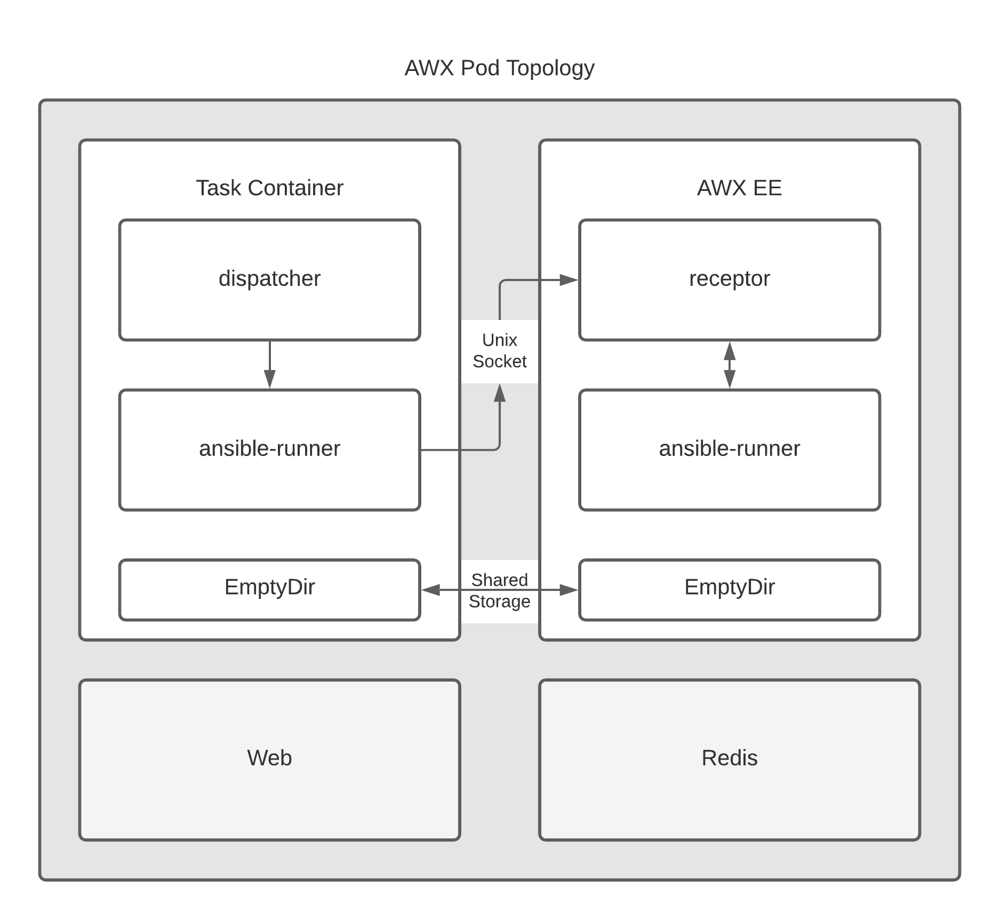

# AWX 17.1.0 Image Build
AWX는 개발자분들을 위한 수동빌드 가이드를 제공합니다. </br>
수동 빌드를 통해 원하는 개발환경의 AWX 컨테이너를 생성할 수 있습니다. 하지만 ```docker compose```에 익숙치 않은 분들은 가이드만 보고 커스텀 설정을 하는것은 매우 번거롭고 학습에 시간이 많이 걸릴 것입니다.</br>

이 가이드에서는 이런분들을 위한 Step by Step 가이드를 제공합니다.

> ### Tips
> netapp ontap 과 연동하는 AWX 환경을 구축하고 계신가요?
> ```netapp.ontap``` 모듈 설치가 되어 있는 커스텀 이미지를 찾고 계신가요?
> 한국넷앱 PSE분들이 빌드한 [이미지](./DockerImages/Readme.md)를 사용해보세요. 버전은 ```17.1.0``` 입니다.

## Getting Start

# AWX 17.1.0 install Guide
AWX 17.1.0 버전을 설치합니다.
- 최신버전 설치는 K8S 환경에서 오퍼레이터를 이용하여 설치해야 합니다.
- RPM 설치는 [AWX-RPM](https://awx.wiki/installation)에서 찾아볼 수 있습니다만 AWX 정식 배포에 포함된 내용이 아닙니다.
## Architecture


> ### AWX 24.0.0 설치
> 작성 당시 최신 버전인 ```24.0.0``` 버전도 설치에 성공했으나 가이드는 ```17.1.0``` 으로 남깁니다.


## Pre-requirment
설치 환경 및 필수 항목들을 정의합니다.
- OS : 페도라 계열 8.x
- CPU : 2 core
- Mem : 4 Mem ( 권장 8 )
- Storage: 20GB of space ()
- Running Docker, Openshift, or Kubernetes
If you choose to use an external PostgreSQL database, please note that the minimum version is 10+.

### Pre-Install
EPEL 리포지토리와 Docker가 모두 Red Hat 서버에 이미 설치되어 있는지 확인하세요. 설정 가이드를 참조하세요.
1. 필요한 패키지 설치
```bash
dnf install git gcc gcc-c++ nodejs gettext device-mapper-persistent-data lvm2 bzip2 python3-pip ansible
```
2. Install Docker Engine, containerd, and Docker Compose:
```bash
sudo yum install -y yum-utils
sudo yum-config-manager --add-repo https://download.docker.com/linux/centos/docker-ce.repo
sudo yum install docker-ce docker-ce-cli containerd.io docker-buildx-plugin docker-compose-plugin
```
3. Start Docker.
```bash
sudo systemctl start docker
pip3 install pyyaml==5.3.1
pip3 install docker-compose
dnf -y installl docker-compose-plugin
```
4. docker-compose 명령 구성
```bash
ln -f -s /usr/libexec/docker/cli-plugins/docker-compose /usr/local/bin/docker-compose
```

## Ansible AWX 17.1.0 설치
1. 다음 명령을 사용하여 v17 릴리스를 복제합니다.
```bash
git clone -b "17.1.0" https://github.com/ansible/awx.git
```
2. 다음 명령을 사용하여 비밀 암호화 키를 생성합니다.
```bash
openssl rand -base64 30
iR0MXri042xWjgqztRXFK1eLERtU+9g2OhYRVWld
```
3. 디렉터리 로 이동하여 인벤토리awx/installer 파일을 찾습니다.
```bash
cd awx/installer/
vim inventory
```
4. inventory 파일 내용을 아래와 같이 수정합니다.
```ini
localhost ansible_connection=local ansible_python_interpreter="/usr/bin/env python3"

[all:vars]
awx_task_hostname=awx
awx_web_hostname=awxweb
postgres_data_dir="/opt/awx/pgdocker"
host_port=80
host_port_ssl=443
docker_compose_dir="/opt/awx/awxcompose"

pg_username=awx

pg_password=awxpass
pg_database=awx
pg_port=5432
#pg_sslmode=require

admin_user=admin
admin_password='NetappKoreaPSE'

# Whether or not to create preload data for demonstration purposes
create_preload_data=True

secret_key=5hThLywmIQ+5cBRYCo7ymhq6C4zH88+qDwX5xiBs

project_data_dir=/opt/awx/projects
```
5. 디렉토리 생성 Docker 사용자가 쓸 수 있는지 확인하세요.
```bash
sudo mkdir /opt/awx
```
6. git clone 한 경로에서 설치 파일을 몇개 수정해야 합니다.
```bash
vim ~/awx/installer/roles/local_docker/tasks/main.yml
```
7. 맨윗줄에 추가
```yaml
- name: Install Docker SDK for Python
  ansible.builtin.pip:
    name:
      - "docker==6.1.3"
      - "docker-compose"
```
8. ```Dockerfile.j2``` 수정
꼭 가이드에 따르지 않더라도 환경에 따라 엔지니어가 직접 판단하여 원하는 환경에 맞게 직접 수정하세요.
```bash
vim ~/awx/installer/roles/image_build/templates/Dockerfile.j2
```
```dockerfile

### This file is generated from
### installer/roles/image_build/templates/Dockerfile.j2
###
### DO NOT EDIT
###

     


# Locations - set globally to be used across stages
ARG COLLECTION_BASE="/var/lib/awx/vendor/awx_ansible_collections"

# Build container
FROM centos:8 as builder

RUN sed -i 's/mirrorlist/#mirrorlist/g' /etc/yum.repos.d/CentOS-*
RUN sed -i 's|#baseurl=http://mirror.centos.org|baseurl=http://vault.centos.org|g' /etc/yum.repos.d/CentOS-*

ENV LANG en_US.UTF-8
ENV LANGUAGE en_US:en
ENV LC_ALL en_US.UTF-8

USER root

# Install build dependencies
RUN dnf -y module enable 'postgresql:12'
RUN dnf -y update && \
    dnf -y install epel-release 'dnf-command(config-manager)' && \
    dnf module -y enable 'postgresql:12' && \
    dnf config-manager --set-enabled powertools && \
    dnf -y install gcc \
    gcc-c++ \
    git-core \
    glibc-langpack-en \
    libcurl-devel \
    libffi-devel \
    libtool-ltdl-devel \
    make \
    nodejs \
    nss \
    openldap-devel \
    patch \
    @postgresql:12 \
    postgresql-devel \
    python39 \
    "python39-devel" \
    "python39-pip" \
    "python39-psycopg2" \
    "python39-setuptools" \
    swig \
    unzip \
    xmlsec1-devel \
    xmlsec1-openssl-devel

RUN pip3 install ansible
RUN python3 -m ensurepip && pip3 install "virtualenv < 20"

# Install & build requirements
ADD Makefile /tmp/Makefile
RUN mkdir /tmp/requirements
ADD requirements/requirements_ansible.txt \
    requirements/requirements_ansible_uninstall.txt \
    requirements/requirements_ansible_git.txt \
    requirements/requirements.txt \
    requirements/requirements_tower_uninstall.txt \
    requirements/requirements_git.txt \
    requirements/collections_requirements.yml \
    /tmp/requirements/

RUN cd /tmp && make requirements_awx requirements_ansible_py3
RUN cd /tmp && make requirements_collections


ADD requirements/requirements_dev.txt /tmp/requirements
RUN cd /tmp && make requirements_awx_dev requirements_ansible_dev



# Use the distro provided npm to bootstrap our required version of node
RUN npm install -g n && n 14.15.1 && dnf remove -y nodejs

# Copy source into builder, build sdist, install it into awx venv
COPY . /tmp/src/
WORKDIR /tmp/src/
RUN make sdist && \
    /var/lib/awx/venv/awx/bin/pip install dist/awx-$(cat VERSION).tar.gz


# Final container(s)
FROM centos:8

ARG COLLECTION_BASE

ENV LANG en_US.UTF-8
ENV LANGUAGE en_US:en
ENV LC_ALL en_US.UTF-8

USER root

# Install runtime requirements
RUN cd /etc/yum.repos.d/
RUN sed -i 's/mirrorlist/#mirrorlist/g' /etc/yum.repos.d/CentOS-*
RUN sed -i 's|#baseurl=http://mirror.centos.org|baseurl=http://vault.centos.org|g' /etc/yum.repos.d/CentOS-*
RUN cd ~

RUN dnf -y module enable 'postgresql:12'
RUN dnf -y update && \
    dnf -y install epel-release 'dnf-command(config-manager)' && \
    dnf module -y enable 'postgresql:12' && \
    dnf config-manager --set-enabled powertools && \
    dnf -y install acl \
    bubblewrap \
    git-core \
    git-lfs \
    glibc-langpack-en \
    krb5-workstation \
    libcgroup-tools \
    nginx \
    @postgresql:12 \
    python39 \
    "python39-devel" \
    "python39-pip" \
    "python39-psycopg2" \
    "python39-setuptools" \
    rsync \
    subversion \
    sudo \
    vim-minimal \
    which \
    unzip \
    xmlsec1-openssl && \
    dnf -y install centos-release-stream && dnf -y install "rsyslog >= 8.1911.0" && dnf -y remove centos-release-stream && \
    dnf -y clean all
RUN dnf -y install libxslt-devel \
    libxml2-devel
RUN dnf -y groupinstall 'Development Tools'

RUN python3 -m ensurepip && pip3 install "virtualenv < 20"
RUN pip3 install ansible
RUN pip3 install netapp.ontap

# Install kubectl
RUN curl -L -o /usr/bin/kubectl https://storage.googleapis.com/kubernetes-release/release/v1.17.8/bin/linux/{{ kubectl_architecture | default('amd64') }}/kubectl && \
    chmod a+x /usr/bin/kubectl

RUN curl -fsSL -o get_helm.sh https://raw.githubusercontent.com/helm/helm/master/scripts/get-helm-3 && \
    chmod 700 get_helm.sh && \
    ./get_helm.sh

# Install tini
RUN curl -L -o /usr/bin/tini https://github.com/krallin/tini/releases/download/v0.19.0/tini-{{ tini_architecture | default('amd64') }} && \
    chmod +x /usr/bin/tini

RUN python3 -m ensurepip && pip3 install "virtualenv < 20" supervisor flake8

RUN rm -rf /root/.cache && rm -rf /tmp/*

# Install OpenShift CLI
RUN cd /usr/local/bin && \
    curl -L https://github.com/openshift/origin/releases/download/v3.11.0/openshift-origin-client-tools-v3.11.0-0cbc58b-linux-64bit.tar.gz | \
    tar -xz --strip-components=1 --wildcards --no-anchored 'oc'


# Install development/test requirements
RUN dnf -y install \
    gdb \
    gtk3 \
    gettext \
    alsa-lib \
    libX11-xcb \
    libXScrnSaver \
    strace \
    vim \
    nmap-ncat \
    nodejs \
    nss \
    make \
    patch \
    socat \
    tmux \
    wget \
    diffutils \
    unzip && \
    npm install -g n && n 14.15.1 && dnf remove -y nodejs

# This package randomly fails to download.
# It is nice to have in the dev env, but not necessary.
# Add it back to the list above if the repo ever straighten up.
RUN dnf --enablerepo=debuginfo -y install python3-debuginfo || :


# Copy app from builder
COPY --from=builder /var/lib/awx /var/lib/awx


RUN openssl req -nodes -newkey rsa:2048 -keyout /etc/nginx/nginx.key -out /etc/nginx/nginx.csr \
        -subj "/C=US/ST=North Carolina/L=Durham/O=Ansible/OU=AWX Development/CN=awx.localhost" && \
    openssl x509 -req -days 365 -in /etc/nginx/nginx.csr -signkey /etc/nginx/nginx.key -out /etc/nginx/nginx.crt && \
    chmod 640 /etc/nginx/nginx.{csr,key,crt}

RUN ln -s /var/lib/awx/venv/awx/bin/awx-manage /usr/bin/awx-manage


# Create default awx rsyslog config
ADD installer/roles/image_build/files/rsyslog.conf /var/lib/awx/rsyslog/rsyslog.conf

## File mappings

ADD tools/docker-compose/launch_awx.sh /usr/bin/launch_awx.sh
ADD tools/docker-compose/awx-manage /usr/local/bin/awx-manage
ADD tools/docker-compose/awx.egg-link /tmp/awx.egg-link
ADD tools/docker-compose/nginx.conf /etc/nginx/nginx.conf
ADD tools/docker-compose/nginx.vh.default.conf /etc/nginx/conf.d/nginx.vh.default.conf
ADD tools/docker-compose/start_tests.sh /start_tests.sh
ADD tools/docker-compose/bootstrap_development.sh /usr/bin/bootstrap_development.sh
ADD tools/docker-compose/entrypoint.sh /entrypoint.sh
ADD tools/scripts/awx-python /usr/bin/awx-python

ADD installer/roles/image_build/files/launch_awx.sh /usr/bin/launch_awx.sh
ADD installer/roles/image_build/files/launch_awx_task.sh /usr/bin/launch_awx_task.sh
ADD installer/roles/image_build/files/settings.py /etc/tower/settings.py
ADD installer/roles/image_build/files/supervisor.conf /etc/supervisord.conf
ADD installer/roles/image_build/files/supervisor_task.conf /etc/supervisord_task.conf
ADD tools/scripts/config-watcher /usr/bin/config-watcher


# Pre-create things we need to access
RUN for dir in \
      /var/lib/awx \
      /var/lib/awx/rsyslog \
      /var/lib/awx/rsyslog/conf.d \
      /var/run/awx-rsyslog \
      /var/log/tower \
      /var/log/nginx \
      /var/lib/postgresql \
      /var/run/supervisor \
      /var/lib/nginx ; \
    do mkdir -m 0775 -p $dir ; chmod g+rw $dir ; chgrp root $dir ; done && \
    for file in \
      /etc/passwd ; \
    do touch $file ; chmod g+rw $file ; chgrp root $file ; done

# Adjust any remaining permissions
RUN chmod u+s /usr/bin/bwrap ; \
    chgrp -R root ${COLLECTION_BASE} ; \
    chmod -R g+rw ${COLLECTION_BASE}


RUN for dir in \
      /var/lib/awx/venv \
      /var/lib/awx/venv/awx/lib/python3.9 \
      /var/lib/awx/projects \
      /var/lib/awx/rsyslog \
      /var/run/awx-rsyslog \
      /.ansible \
      /var/lib/awx/vendor ; \
    do mkdir -m 0775 -p $dir ; chmod g+rw $dir ; chgrp root $dir ; done && \
    for file in \
      /var/run/nginx.pid \
      /var/lib/awx/venv/awx/lib/python3.9/site-packages/awx.egg-link ; \
    do touch $file ; chmod g+rw $file ; done



RUN ln -sf /dev/stdout /var/log/nginx/access.log && \
    ln -sf /dev/stderr /var/log/nginx/error.log


ENV HOME="/var/lib/awx"
ENV PATH="/usr/pgsql-10/bin:${PATH}"


EXPOSE 8043 8013 8080 22

ENTRYPOINT ["/entrypoint.sh"]
CMD ["/bin/bash"]

USER 1000
EXPOSE 8052

ENTRYPOINT ["/usr/bin/tini", "--"]
CMD /usr/bin/launch_awx.sh
VOLUME /var/lib/nginx

```
9. requirements 항목에서 아래 표기된 항목에 해당하는 파일을 찾아 수정하세요
수정 시 ```jinja2>=2.11.0``` 또는 ```jinja2==3.1.2``` 입니다.
```bash
cd /opt/awxgit/requirements
grep -H jinja2 *
```
```bash
requirements_ansible.in:jinja2>=2.11.0  # required for native jinja2 types for inventory compat mode
requirements_ansible.txt:jinja2>=2.11.0            # via -r /awx_devel/requirements/requirements_ansible.in, openshift
requirements.in:jinja2>=2.11.0  # required for ChainableUndefined
requirements.txt:jinja2>=2.11.0           # via -r /awx_devel/requirements/requirements.in, openshift
```

10. 이제 ```​~/awx/installer/``` 내부에서 Ansible 명령을 따라 Ansible AWX를 설치할 수 있습니다.
```bash
sudo ansible-playbook -i inventory install.yml
```
완료되면 아래와 같이 보입니다.
```bash
[root@ip-172-30-8-205 mytest]# docker ps
CONTAINER ID   IMAGE         COMMAND                  CREATED       STATUS       PORTS                                       NAMES
3fd607875364   awx:17.1.0    "/usr/bin/tini -- /u…"   2 hours ago   Up 2 hours   8052/tcp                                    awx_task
6986f4db3670   awx:17.1.0    "/usr/bin/tini -- /b…"   2 hours ago   Up 2 hours   0.0.0.0:80->8052/tcp, :::80->8052/tcp       awx_web
e8547418bef8   redis         "docker-entrypoint.s…"   2 hours ago   Up 2 hours   6379/tcp                                    awx_redis
3a38e2d21f91   postgres:12   "docker-entrypoint.s…"   2 hours ago   Up 2 hours   5432/tcp                                    awx_postgres
fc8cb21f3d3c   registry:2    "/entrypoint.sh /etc…"   10 days ago   Up 10 days   0.0.0.0:5000->5000/tcp, :::5000->5000/tcp   registry
```


# 참조
- [AWX 17.1.0 install guide](https://github.com/ansible/awx/blob/17.0.1/INSTALL.md)
- [RHEL8에 Ansible Tower(Docker의 AWX) 설치](https://mpolinowski.github.io/docs/DevOps/Ansible/2021-04-28-ansible-tower-rhel/2021-04-28/)
- [구성 오류 - kwargs_from_env()에 성공하지 못했습니다. 'ssl_version이 있습니다.](https://github.com/geerlingguy/internet-pi/issues/567)
- [[버그] "pip install docker-compose"가 debian 12에서 실패합니다.](https://github.com/docker/compose/issues/11168)
- [Ansible tower 요구사항](https://docs.ansible.com/ansible-tower/latest/html/installandreference/requirements_refguide.html#ansible-software-requirements)

# 참조
- [AWX 17.1.0 install guide](https://github.com/ansible/awx/blob/17.0.1/INSTALL.md)
- [RHEL8에 Ansible Tower(Docker의 AWX) 설치](https://mpolinowski.github.io/docs/DevOps/Ansible/2021-04-28-ansible-tower-rhel/2021-04-28/)
- [구성 오류 - kwargs_from_env()에 성공하지 못했습니다. 'ssl_version이 있습니다.](https://github.com/geerlingguy/internet-pi/issues/567)
- [[버그] "pip install docker-compose"가 debian 12에서 실패합니다.](https://github.com/docker/compose/issues/11168)
- [Ansible tower 요구사항](https://docs.ansible.com/ansible-tower/latest/html/installandreference/requirements_refguide.html#ansible-software-requirements)
- [task_execute_ansible_playbook_using_docker](https://docs.netapp.com/us-en/active-iq/task_execute_ansible_playbook_using_docker.html#before-you-begin)