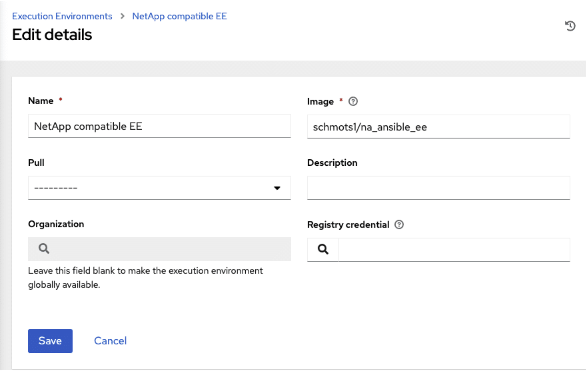

# AWX install_with_kind
test 결과 결국 외부레포 연동이 되어야함

## 설치 가이드 라인
Controller의 OpenSource 업스트림 버전인 AWX(공식적으로 Ansible Tower라고 함)는 최근 많은 변화를 겪었습니다. </br>
이러한 변경으로 인해 설치 및 설정 프로세스가 훨씬 더 어려워졌습니다. </br>
새로운 설치 방법에는 Kubernetes도 필요합니다. </br>
모든 사람이 그런 식으로 AWX를 실행하거나 실행하고 싶어하는 것은 아닙니다. </br>
AWX의 단일 노드 설치에 대해 최종 사용자로부터 많은 요청을 받았습니다. </br>
따라서 단일 노드에서 적절한 설정을 보장하기 위해 새로운 프로세스를 만들었습니다.

## 요구 사항
- Minimum 4 cpu cores
- Minimum 6 gigs RAM
- Docker - https://docs.docker.com/get-docker/
- No other containers running on host. AWX must be the only Dockerized function.
- 실행 권한: Docker 권한이 있는 표준 사용자 또는 root

유일한 소프트웨어 요구 사항은 Docker입니다. </br>
내가 만든 방법은 사용자 지정 Docker 이미지를 사용하여 Docker가 있는 호스트의 'kind'라고 하는 Docker에 Kubernetes를 설치하는 것입니다. </br>
현재 AWX를 올바르게 사용하는 데 필요한 FQDN을 통해 AWX에 연결할 수 있도록 적절한 수신이 설정됩니다. </br>
이미지를 사용하여 AWX 구성을 백업하거나 종류를 완전히 제거하는 방법도 있습니다.</br>

> ### ```Kind```에 대한 참고사항
> [Kind](https://github.com/kubernetes-sigs/kind)는  Docker 컨테이너 "노드"를 사용하여 로컬 Kubernetes 클러스터를 실행하기 위한 도구입니다.</br>
> ```kind```는 주로 ```Kubernetes``` 자체를 테스트하기 위해 설계되었지만 로컬 개발이나 CI에 사용될 수도 있습니다.

## 설치 Step by Step

1. 먼저 Kubernetes 구성 파일을 저장할 수 있는 디렉터리를 만들겠습니다.
```bash
mkdir /home/user/kind_awx
cd /home/user/kind_awx
```
2. ```/home/user/kind_awx```를 이 파일을 보관할 위치로 바꾸세요. 모든 추가 명령은 항상 해당 디렉터리에 있는 동안 실행되어야 합니다.
```bash
docker run --rm --name kind_deploy -v /var/run/docker.sock:/var/run/docker.sock -v 
(pwd):/root/.kube/ -it schmots1/kind_awx
```
이 명령은 Docker 이미지를 다운로드하고 호스트 Docker 소켓에 액세스할 수 있는 임시 컨테이너를 생성할 뿐만 아니라 현재 있는 디렉터리를 Kubernetes 구성 파일 및 awx에 대한 임시 컨테이너의 /root/.kube 디렉터리에 매핑합니다. </br>
```yml``` 연산자 파일.
그런 일이 발생하면 컨테이너는 kind-control-plane이라는 컨테이너에 종류를 배포하고 해당 Kubernetes 환경에 AWX를 설치합니다.
```
kind create cluster --image kindest/node:v1.19.11 --config kind.yml
```

```
Creating cluster "kind" ...
 ✓ Ensuring node image (kindest/node:v1.19.11) 🖼
 ✓ Preparing nodes 📦
 ✓ Writing configuration 📜
 ✓ Starting control-plane 🕹️
 ✓ Installing CNI 🔌
 ✓ Installing StorageClass 💾
Set kubectl context to "kind-kind"
You can now use your cluster with:
kubectl cluster-info --context kind-kindHave a nice day! 👋
```

```
sed -i "s/^    server:.*/    server: https:\/\/172.17.0.2:6443/" /root/.kube/config
kubectl apply -f https://raw.githubusercontent.com/kubernetes/ingress-nginx/main/deploy/static/provider/kind/deploy.yaml
```

```
namespace/ingress-nginx created
serviceaccount/ingress-nginx created
configmap/ingress-nginx-controller created
clusterrole.rbac.authorization.k8s.io/ingress-nginx created
clusterrolebinding.rbac.authorization.k8s.io/ingress-nginx created
role.rbac.authorization.k8s.io/ingress-nginx created
rolebinding.rbac.authorization.k8s.io/ingress-nginx created
service/ingress-nginx-controller-admission created
service/ingress-nginx-controller created
deployment.apps/ingress-nginx-controller created
validatingwebhookconfiguration.admissionregistration.k8s.io/ingress-nginx-admission created
serviceaccount/ingress-nginx-admission created
clusterrole.rbac.authorization.k8s.io/ingress-nginx-admission created
clusterrolebinding.rbac.authorization.k8s.io/ingress-nginx-admission created
role.rbac.authorization.k8s.io/ingress-nginx-admission created
rolebinding.rbac.authorization.k8s.io/ingress-nginx-admission created
job.batch/ingress-nginx-admission-create created
job.batch/ingress-nginx-admission-patch created
```

```
kubectl apply -f password.yml
```

```
secret/awx-admin-password created
```

```
kubectl apply -f https://raw.githubusercontent.com/ansible/awx-operator/0.12.0/deploy/awx-operator.yaml
```

```
customresourcedefinition.apiextensions.k8s.io/awxs.awx.ansible.com created
customresourcedefinition.apiextensions.k8s.io/awxbackups.awx.ansible.com created
customresourcedefinition.apiextensions.k8s.io/awxrestores.awx.ansible.com created
clusterrole.rbac.authorization.k8s.io/awx-operator created
clusterrolebinding.rbac.authorization.k8s.io/awx-operator created
serviceaccount/awx-operator created
deployment.apps/awx-operator created
FQDN: awx.example.com
```

```
kubectl apply -f awx.yml
```

```
awx.awx.ansible.com/awx created
```

3. AWX에 사용할 FQDN을 묻는 메시지가 표시됩니다. 이는 DNS에 있어야 하지만 해당 도메인이 이 호스트를 가리키도록 ```/etc/hosts``` 파일을 편집할 수도 있습니다.
위의 예에서는 FQDN에 ```awx.example.com```을 사용했고 이 줄은 내 DNS에 없기 때문에 ```/etc/hosts```에 추가했습니다.
```
172.31.199.143           awx.example.com
```
이렇게 하면 ```https://awx.example.com``` 으로 이동하여 172.31.199.143에서 종류를 실행하는 호스트로 라우팅될 수 있습니다. 호스트 IP 주소를 사용해야 합니다.

AWX의 초기 설정에는 5~10분이 소요됩니다. ```https://awx.example.com```에 로그인 화면이 표시되면 완료되었음을 알 수 있습니다 .

기본 로그인은 다음과 같습니다:
- U: admin
- P: 비밀번호

이제 AWX는 실행 환경(EE)이라는 새로운 개념을 사용합니다. 
즉, AWX를 업데이트하지 않고도 Ansible 엔진을 업데이트하거나 여러 버전의 엔진 또는 컬렉션을 실행할 수도 있습니다. 
단점은 AWX가 사용하는 기본 시스템 EE가 NetApp 컬렉션에서 작동하지 않는다는 것입니다. 다행히도 이를 수행하는 EE가 있습니다.

AWX에 로그인하고 실행 환경 섹션으로 이동합니다.

여기서는 다음 설정으로 새 EE를 추가합니다.

이 EE에 대해 실행하게 될 NetApp 모듈이 포함된 플레이북을 실행하기 위해 생성하는 모든 작업 템플릿입니다.

그러나 이 설정에는 문제가 없는 것은 아닙니다. 무엇보다도 Tower에서 일어나는 일에 대한 지속적인 데이터가 있습니다. 데이터는 /var/lib/docker/volumes에 로컬로 저장됩니다. 전체 경로를 얻으려면 `docker Volume ls`를 실행한 다음 `docker Volume Inspection <uuid of Volume>`을 실행할 수 있습니다.

다음 문제는 이 Kubernetes가 Docker 내부에 있기 때문에 호스트를 재부팅하면 제어 플레인이 중지되고 내부 Docker 네트워크가 약간 변경되어 수신이 중단된다는 것입니다. 하지만 설치 컨테이너에는 수정 사항이 포함되어 있습니다. AWX 호스트가 재부팅되는 경우 이전에 생성한 디렉터리 내에서 다음을 실행합니다.
```
docker run --rm --name kind_deploy -v /var/run/docker.sock:/var/run/docker.sock -v $(pwd):/root/.kube/ -it schmots1/kind_awx fix
```
제어 영역이 다시 시작되고 수신 라우팅 업데이트가 완료되는 데 1분 정도 걸릴 수 있습니다.

문제가 발생하여 처음부터 다시 시작하려는 경우 이 명령을 실행하여 종류를 제거할 수 있습니다.
```
docker run --rm --name kind_deploy -v /var/run/docker.sock:/var/run/docker.sock -v $(pwd):/root/.kube/ -it schmots1/kind_awx clean
```

# 참조
- [Netapp.io how-to-guide-setting-up-awx-on-a-single-host](https://netapp.io/2021/08/19/how-to-guide-setting-up-awx-on-a-single-host/)
- [github kind](https://github.com/kubernetes-sigs/kind)