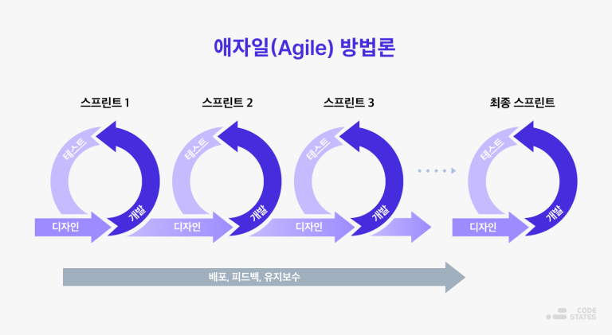
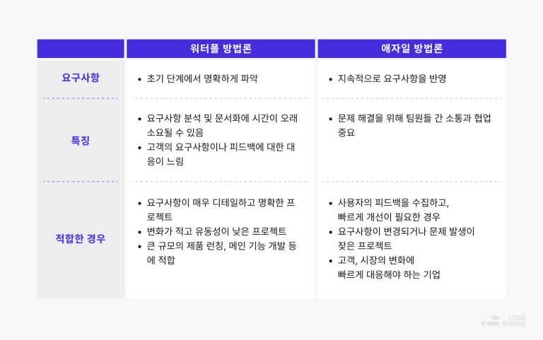
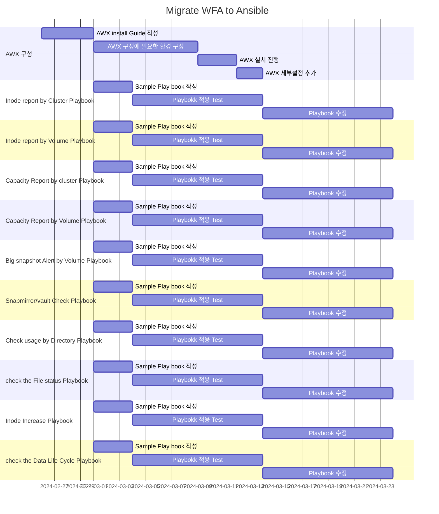

# Ansible Playbook 작성
WFA가 곧 EOA 된다고 합니다. 
Netapp WFA를 AWX 로 마이그레이션 하는 프로젝트를 진행중입니다.

## 프로젝트 상세 목표
1. 인터넷이 제한된 환경에서 AWX 환경을 구성하는 가이드 작성
2. 아래 기능을 플레이북으로 구현
   1. Inode Summary : 전체 Cluster 별 Inode 현황을 매일 메일로 담당자에게 전송
   2. Inode Report: 전체 Volume 별 Inode 현황을 매일 메일로 담당자에게 전송
   3. Capacity Summery: 전체 Cluster 별 용량 사용 현황을 매일 메일로 담당자에게 전송
   4. Capacity Report: 전체 Volume 별 용량 사용 현황을 매일 메일로 담당자에게 전송
   5. Capacity Report 전체 Cluster/Node 지정하여 용량 사용 현황을 매일 메일로 담당자에게 전송
   6. Big snapshot Alert: Volume 사용량이 50% 이상,Snapshot size가 1TB 이상
   7. Snapmirror/vault check: 정상 여부 확링
   8. 사용량 DU 메일링: 사용량이 많은 프로젝트 Volume에 대하여 주요 Directory 사용량을 확인하여 프로젝트 인원에게 메일 발송
   9. 특정 확장자, Size File 메일링: XCP 를 활용하여 특정 확장자 or 특정 Size 의 File 을 찾아 소유자에게 메일링, 
   10. 완료 snapshot 삭제: Update 가 완료 된 Source 측 snapshot을 확인 후 삭제
   11. Inode Increase: Inode 사용률 75% 이상 인 Volume 에 대하여 Inode 증설
   12. DLC (Data Life Cycle) : Storage 에서 특정 확장자 별로 Listup 하여 Report, 특정 기간이 지난 확장자에 대하여 삭제 진행, 위의 내용이 History 관리가 가능해야 함

## 진행맴버
- 안우영( wooyoung.ahn@netapp.com )
- 유한민 ( hanmin731@wezon.com )

## Task table
프로젝트 진행 중 예상치 못한 issue나 Task가 추가될 수 있습니다. 
하지만 고객측에서는 전체적인 프로젝트 종료 예상날짜에 대해 업데이트 받기를 원합니다. 
진행상황에 대해 업데이트를 아래와 같이 보여드리며  
진행방식은 [Agile 방법](https://www.redhat.com/ko/topics/devops/what-is-agile-methodology)과 유사한 방법으로 진행할 계획입니다.

> ### Tips Agile 간략설명
> 
> 

> ### 상태 설명
> - New : 새로운 Task 등록
> - Active : Task 진행중
> - Pending : 외부또는 내부 이슈로 인해 대기 상태
> - close : 완료

|분류|Task|담당자|상태|주석|
|---|---|---|---|---|
| AWX 구성 | AWX 설치 가이드 작성 | 안우영 | close | [가이드 문서](../AWX/install/Readme.md) |
| AWX 구성 | AWX 설치를 위한 환경 구성 | 유한민 | Active | --- |
| AWX 구성 | AWX 설치 진행 | 안우영 | New | --- |

# Gantt

