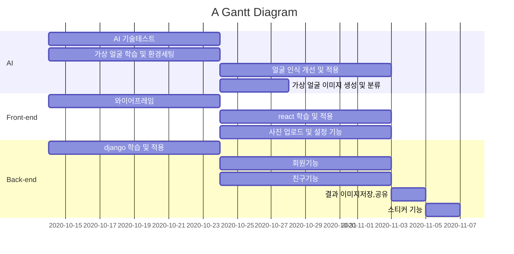

# Ansible Playbook 작성
Netapp WFA를 AWX 로 마이그레이션 하는 프로젝트를 진행중입니다.

## 프로젝트 상세 목표
1. 인터넷이 제한된 환경에서 AWX 환경을 구성하는 가이드 작성
2. 아래 기능을 플레이북으로 구현
   1. Inode Summary : 전체 Cluster 별 Inode 현황을 매일 메일로 담당자에게 전송
   2. Inode Report: 전체 Volume 별 Inode 현황을 매일 메일로 담당자에게 전송
   3. Capacity Summery: 전체 Cluster 별 용량 사용 현황을 매일 메일로 담당자에게 전송
   4. Capacity Report: 전체 Volume 별 용량 사용 현황을 매일 메일로 담당자에게 전송
   5. Capacity Report 전체 Cluster/Node 지정하여 용량 사용 현황을 매일 메일로 담당자에게 전송
   6. Big snapshot Alert: Volume 사용량이 50% 이상,Snapshot size가 1TB 이상
   7. Snapmirror/vault check: 정상 여부 확링
   8. 사용량 DU 메일링: 사용량이 많은 프로젝트 Volume에 대하여 주요 Directory 사용량을 확인하여 프로젝트 인원에게 메일 발송
   9. 특정 확장자, Size File 메일링: XCP 를 활용하여 특정 확장자 or 특정 Size 의 File 을 찾아 소유자에게 메일링, 
   10. 완료 snapshot 삭제: Update 가 완료 된 Source 측 snapshot을 확인 후 삭제
   11. Inode Increase: Inode 사용률 75% 이상 인 Volume 에 대하여 Inode 증설
   12. DLC (Data Life Cycle) : Storage 에서 특정 확장자 별로 Listup 하여 Report, 특정 기간이 지난 확장자에 대하여 삭제 진행, 위의 내용이 History 관리가 가능해야 함

## 진행맴버
- 안우영( wooyoung.ahn@netapp.com )

# Gantt

