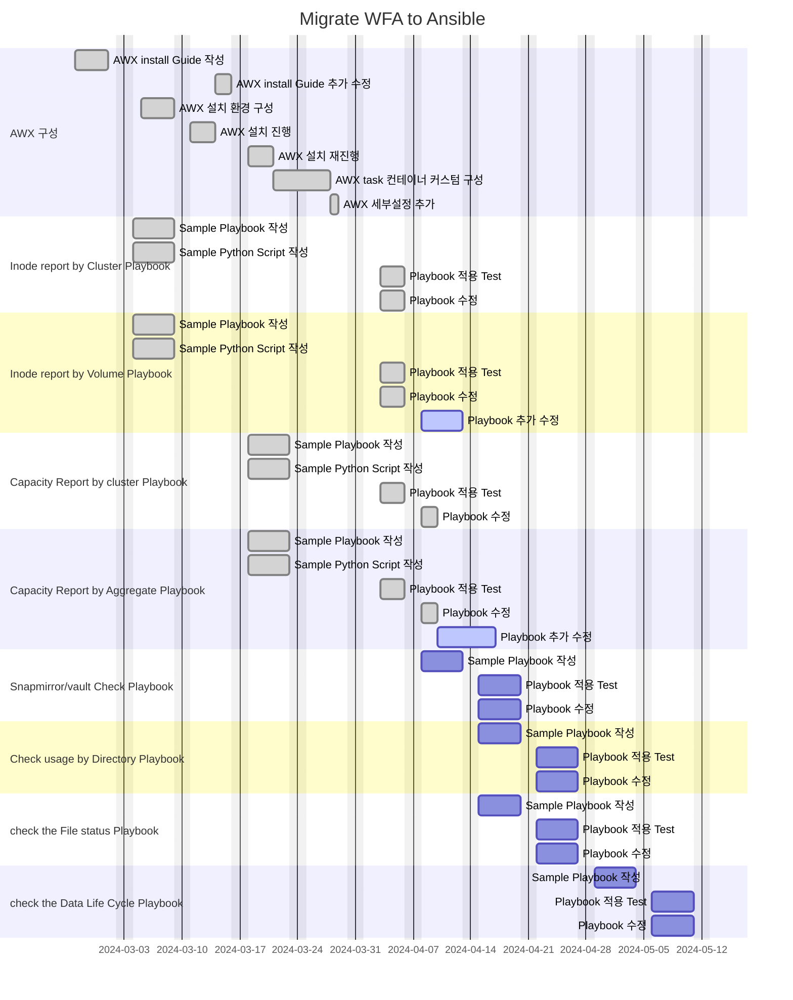
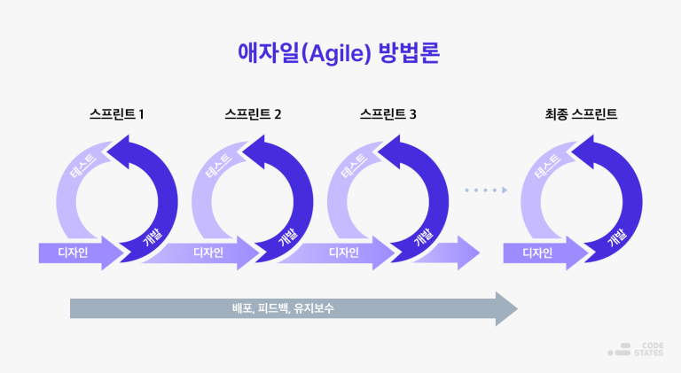
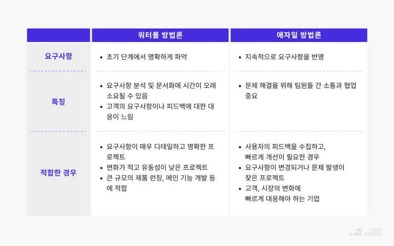

# Ansible Playbook 작성
WFA가 곧 EOA 된다고 합니다. 
Netapp WFA를 AWX 로 마이그레이션 하는 프로젝트를 진행중입니다.

## 프로젝트 상세 목표
1. AWX 환경을 구성하는 가이드 작성
2. 아래 기능을 플레이북으로 구현
    1. Inode Summary : 전체 Cluster 별 Inode 현황을 매일 메일로 담당자에게 전송
    2. Inode Report: 전체 Volume 별 Inode 현황을 매일 메일로 담당자에게 전송
        1. 모든 클러스터의 Volume Inode 정보가 한 메일에 출력
    3. Capacity Summery: 전체 Cluster 별 용량 사용 현황을 매일 메일로 담당자에게 전송
    4. Capacity Report: 전체 Volume 별 용량 사용 현황을 매일 메일로 담당자에게 전송
        1. 추가 항목 : snapshot reserve 공간 표시
        2. aggr 용량 정보와 volume 용량정보을 한 메일에 출력
    5. Capacity Report 전체 Cluster/Node 지정하여 용량 사용 현황을 매일 메일로 담당자에게 전송
        1. 추가 항목 : snapshot reserve 공간 표시
    6. ~~Big snapshot Alert: Volume 사용량이 50% 이상,Snapshot size가 1TB 이상~~
    7. Snapmirror/vault check: 정상 여부 확인
    8. 사용량 DU 메일링: 사용량이 많은 프로젝트 Volume에 대하여 주요 Directory 사용량을 확인하여 프로젝트 인원에게 메일 발송
    9. 특정 확장자, Size File 메일링: XCP 를 활용하여 특정 확장자 or 특정 Size 의 File 을 찾아 소유자에게 메일링, 
    10. 완료 snapshot 삭제: Update 가 완료 된 Source 측 snapshot을 확인 후 삭제
    11. ~~Inode Increase: Inode 사용률 75% 이상 인 Volume 에 대하여 Inode 증설~~  
    [UM으로 대체하기로 결정](https://github.com/netappkr/NetAppCloudSolutionCenter/tree/master/py-RestAPI/Ontap/AIQUM%20Script)
    12. DLC (Data Life Cycle) : Storage 에서 특정 확장자 별로 Listup 하여 Report, 특정 기간이 지난 확장자에 대하여 식별 진행, 위의 내용이 History 관리가 가능해야 함

## 진행맴버
- 안우영( wooyoung.ahn@netapp.com )
- 유한민 ( hanmin731@wezon.com )

## Task table
프로젝트 진행 중 예상치 못한 issue나 Task가 추가될 수 있습니다. 
하지만 고객측에서는 전체적인 프로젝트 종료 예상날짜에 대해 업데이트 받기를 원합니다. 
진행상황에 대해 아래와 같이 보여드리며  
진행방식은 [Agile 방법](https://www.redhat.com/ko/topics/devops/what-is-agile-methodology)과 유사한 방법으로 진행할 계획입니다.

> Task 상태에 대한 설명은 참조란을 확인합니다.

### 이슈사항 요약
- [등록된 AWX 설치가이드가 인터넷이 차단된 환경에서 작동하지 않습니다.](https://github.com/netappkr/AnsiblePlaybook/issues/2)

Task table

|분류|Task|시작일자|종료일자|담당자|상태|산출물|주석|
|----|--- |  ---  |  ---  | ---  |---| ---- |---|
| AWX 구성                          | AWX 설치 가이드 작성           |2024-02-26|2024-02-29| 안우영 | done | [가이드 문서](../AWX/install/Readme.md) | --- |
| AWX 구성                          | AWX 설치 환경 구성             |2024-03-05|2024-03-08| 유한민 | done | --- | --- |
| AWX 구성                          | AWX 설치                      |2024-03-11|2024-03-13| 안우영,유한민 | done | ---  | 외부레포 이용 문제로 가이드 수정후 재시도 |
| AWX 구성                          | AWX 설치 가이드 추가 수정       |2024-03-14|2024-03-15| 안우영 | done | [가이드 문서](../AWX/install/install_with_out_internet.md) | --- |
| AWX 구성                          | AWX 설치 재진행                |2024-03-18|2024-03-20| 안우영,유한민 | done | 설치 완료  | --- |
| AWX 구성                          | AWX task 컨테이너 커스텀 구성   |2024-03-21|2024-03-27| 안우영 | done | [이슈](https://github.com/netappkr/AnsiblePlaybook/issues/3) 답변 완료   | --- |
| Inode report by Cluster Playbook | Sample Playbook 작성           |2024-03-04|2024-03-08| 안우영 | done | [Inode report by Cluster Playbook](./playbooks/GetInodebyCluster.yaml) | --- |
| Inode report by Cluster Playbook | Sample python script 작성      |2024-03-04|2024-03-08| 안우영 | done | [generate_table.py](./script/generate_table.py) | --- |
| Inode report by Cluster Playbook | Playbook 적용 Test             |2024-04-03|2024-04-05| 안우영,유한민 | done | --- | --- |
| Inode report by Volume Playbook  | Sample Playbook 작성           |2024-03-04|2024-03-08| 안우영 | done | [Inode report by Volume Playbook](./playbooks/GetInodebyVolume.yaml) | --- |
| Inode report by Volume Playbook  | Sample python script 작성      |2024-03-04|2024-03-08| 안우영 | done | [generate_table.py](./script/generate_table.py) | --- |
| Inode report by Volume Playbook  | Playbook 적용 Test             |2024-04-03|2024-04-05| 안우영,유한민 | active | --- | --- |
| Capacity Report by cluster Playbook | Sample Playbook 작성        |2024-03-18|2024-03-22| 안우영 | done | [Capacity Report by cluster Playbook](./playbooks/GetSpaceUsagebyCluster.yaml) | --- |
| Capacity Report by cluster Playbook  | Sample python script 작성  |2024-03-18|2024-03-22| 안우영 | done | [generate_table.py](./script/generate_table.py) | --- |
| Capacity Report by cluster Playbook  | Playbook 적용 Test         |2024-04-03|2024-04-05| 안우영,유한민 | done | --- |
| Capacity Report by cluster Playbook  | Playbook 수정              |2024-04-08|2024-04-09| 안우영 | done | --- | --- |
| Capacity Report by Volume Playbook | Sample Playbook 작성         |2024-03-18|2024-03-22| 안우영 | done | [Capacity Report by cluster Playbook](./playbooks/GetSpaceUsagebyCluster.yaml) | --- |
| Capacity Report by Volume Playbook  | Sample python script 작성   |2024-03-18|2024-03-22| 안우영 | done | [generate_table.py](./script/generate_table.py) | --- |
| Capacity Report by Volume Playbook  | Playbook 적용 Test          |2024-04-03|2024-04-05| 안우영,유한민 | active | --- | --- |
| Capacity Report by Volume Playbook  | Playbook 수정               |2024-04-08|2024-04-09| 안우영 | active | --- | --- |

# Gantt

# 참조
- [애자일과 워터폴 방법론 비교 | 정의, 차이, 장단점, 적합한 조직](https://www.codestates.com/blog/content/%EC%95%A0%EC%9E%90%EC%9D%BC%EB%B0%A9%EB%B2%95%EB%A1%A0-%EC%9B%8C%ED%84%B0%ED%8F%B4%EB%B0%A9%EB%B2%95%EB%A1%A0)
- [mermaid](https://mermaid.js.org/syntax/gantt.html)
- [Gantt example](https://github.com/mermaidjs/mermaidjs.github.io/blob/master/gantt.md)
### Task 상태 설명
- New : 새로운 Task 등록
- Active : Task 진행중
- Pending : 외부또는 내부 이슈로 인해 대기 상태
- done : 완료

### Agile 간략설명

