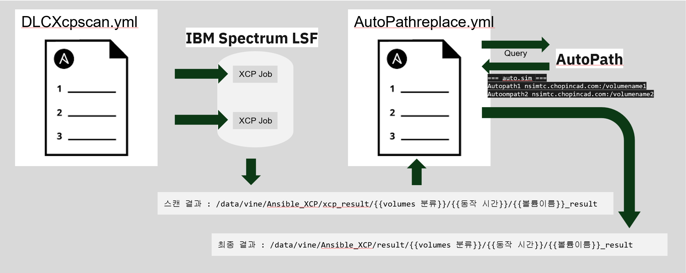

# AutoPath


```powershell
python3 Autopath.py -f .\xcpsample\sim_cis_hil013h_result.txt -a autopath.txt --searchdir Test
```
```powershell
4 /hil013h/sim_cis_hil013h/Test/asd.fsdb
0 /hil013h/sim_cis_hil013h/Test/asd.sp.fsdb
0 /hil013h/sim_cis_hil013h/Test/a.tr
0 /hil013h/sim_cis_hil013h/Test/a.tr0
0 /hil013h/sim_cis_hil013h/Test/qqq.wlf
```