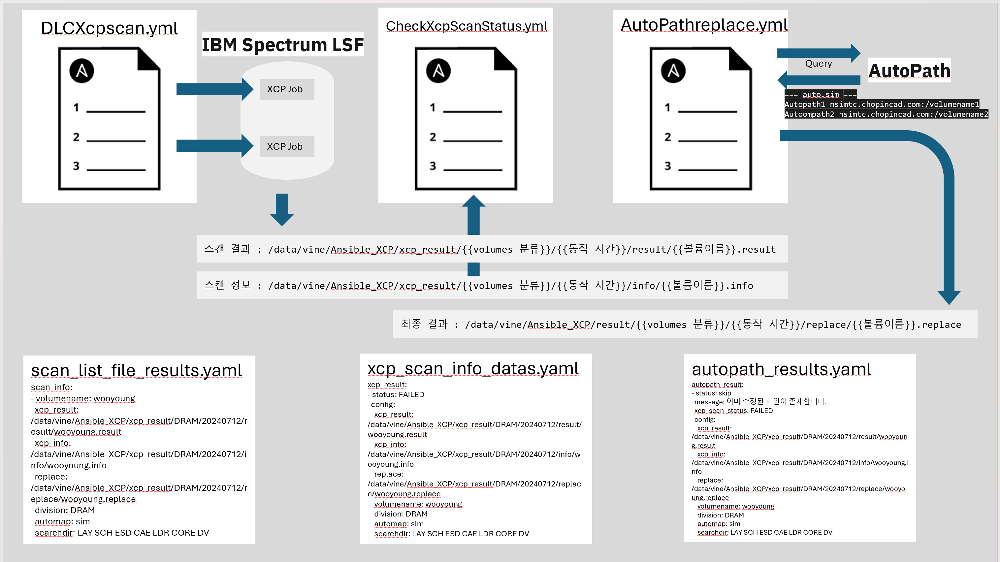

# 파일 라이프 사이클 관리
xcp 스캔을 사용하여 운영에 필요한 File 수명주기 관리 기능을 구현하는 스크립트 입니다.

### 경고
xcp 스캔을 이용하여 file 정보를 주기적으로 수집하는 행위는 일반적으로 권장하지 않습니다.</br>
이번처럼 특수한 상황이 아니라면 스토리지에서 제공하는 [ NetApp ONTAP File System Analytics ](https://docs.netapp.com/us-en/ontap/concept_nas_file_system_analytics_overview.html#learn-more-about-file-system-analytics) 기능을 이용하여 구현하는 것을 권장합니다.

## 동작 방식 설명
AWX에 등록된 플레이북과 스크립트를 이용하여 xcp 스캔 후 사용자가 바라보는 HP사의 AUTOPATH로 치환한 파일경로를 출력합니다.
각 플레이북은 비동기 상태로 동작하도록 설계되어 있으며 각 이전 플레이북의 status를 참고하여 동작합니다.



### DLCXcpscan.yml
1. inventory에서 지정된 cluster에서 볼륨 목록을 조회 후 
2. 사용자가 지정한 조건대로 xcp scan을 수행 할 볼륨 목록을 출력합니다. 이때 인벤토리 설정 파일의 ```DLC``` 속성을 참고합니다.
3. IBM Spectrum LSF(큐 서비스)에 XCP 작업을 제출합니다. 

### CheckXcpScanStatus.yaml
1. xcp scan 리스트를 참조하여 xcp scan job 상태를 검사하고 현재 상태를 반환합니다.
2. 관리자에게 작업 목록을 이메일로 발송합니다. 

### AutoPathreplace.yaml
1. xcp scan job의 작업결과 파일을 읽습니다.
2. AutoPath 시스템에 데이터를 조회하여 NFS 볼륨과 일치하는 AutoPath 결과를 찾습니다.
3. Path값을 AutoPath 결과로 변환하여 결과 파일을 출력합니다.
4. 관리자에게 작업에 대한 상태를 이메일로 발송합니다.

# 참조
- [ NetApp DoC ONTAP File System Analytics ](https://docs.netapp.com/us-en/ontap/concept_nas_file_system_analytics_overview.html#learn-more-about-file-system-analytics)
- [ NetApp ONTAP File System Analytics Technical Presentation](./Images/NetApp%20ONTAP%20File%20System%20Analytics%20Technical%20Presentation%20(3).pdf)